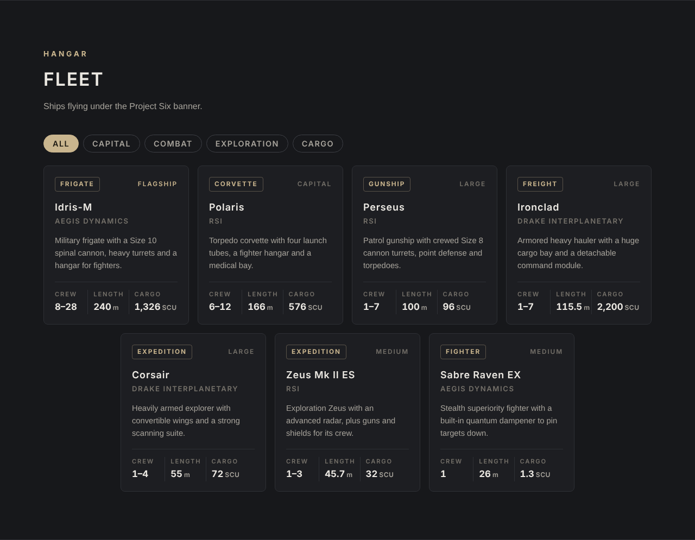

<p align="center">
  
</p>

<h1 align="center">Project Six</h1>

<p align="center">
  Organization website for <strong>Project Six</strong>, a Star Citizen fleet.<br>
  Single-page site built with plain HTML, CSS and JavaScript, with a live RSI news and patch feed.
</p>

<p align="center">
  <a href="https://YOUR-USERNAME.github.io/project-six/"><strong>View the live site</strong></a>
</p>

---

## Overview

Project Six needed a home page that recruits new members, shows off the fleet and keeps everyone up to date on game patches without anyone posting updates by hand. The site is a single `index.html` file with no build step and no framework, so it can be hosted on GitHub Pages or embedded in Google Sites as-is.

## Features

- **Hero carousel** with crossfading in-game screenshots and a per-letter title reveal on first load.
- **Live RSI updates** carousel that pulls the latest Comm-Link posts and Spectrum patch notes (Live and PTU), checks for new posts every two minutes, and flags new arrivals without a page reload.
- **Fleet showcase** of the org's ships with real specs (crew, length, cargo) and role filters.
- **Enlistment form** that formats an application and copies it to the clipboard for posting in the org's Discord.
- **Responsive layout** that adapts from wide desktop screens down to phones.
- **Accessible motion:** animations are disabled for visitors who turn on reduced motion in their system settings.

<p align="center">
  
</p>

## How the live feed works

Browsers block a website from reading another site's data directly (CORS), so the page can't fetch RSI's feeds on its own. A small Google Apps Script relay solves this:

```
Browser (index.html)
   │  GET every 2 min
   ▼
Google Apps Script relay (rsi-feed-relay.gs)
   │  cached 90 s, shared across all visitors
   ├──► RSI Comm-Link   (RSS → hub endpoint → page, first that works)
   └──► Spectrum Patch Notes forum (forum API → page fallback)
   ▼
JSON: newest posts and patch notes, merged and sorted by date
```

- The relay runs free on Google's servers and caches results, so RSI is contacted at most once every 90 seconds no matter how many people visit.
- Each source has fallbacks, so a change on one RSI endpoint doesn't take the feed down.
- On the page, the status light only shows **Live** after a successful fetch. If the relay can't be reached, the page shows a saved list of recent posts and says so.

## Tech stack

| Area | Tools |
|---|---|
| Front end | HTML5, CSS (custom properties, grid, flexbox), vanilla JavaScript |
| Backend relay | Google Apps Script (`UrlFetchApp`, `CacheService`, `ContentService`) |
| Hosting | GitHub Pages, Google Sites embed |
| Fonts | Orbitron, Rajdhani, Barlow (Google Fonts) |

## Project structure

```
project-six/
├── index.html           the whole site: markup, styles, scripts and embedded images
├── rsi-feed-relay.gs    Google Apps Script relay for the live RSI feed
├── assets/
│   ├── logo.png         Project Six logo
│   └── fleet.png        README screenshot
├── LICENSE
└── README.md
```

## Credits and disclaimer

Ship specifications are from the [Star Citizen Wiki](https://starcitizen.tools) and may change as the game is updated.

This is an unofficial fan site and is not affiliated with or endorsed by Cloud Imperium Games. Star Citizen®, Roberts Space Industries® and Cloud Imperium® are registered trademarks of Cloud Imperium Rights LLC. In-game screenshots show content owned by Cloud Imperium Games.

## License

The source code in this repository is released under the [MIT License](LICENSE). The license covers the code only. It does not cover Star Citizen trademarks, game content or in-game screenshots, which belong to Cloud Imperium Games.
